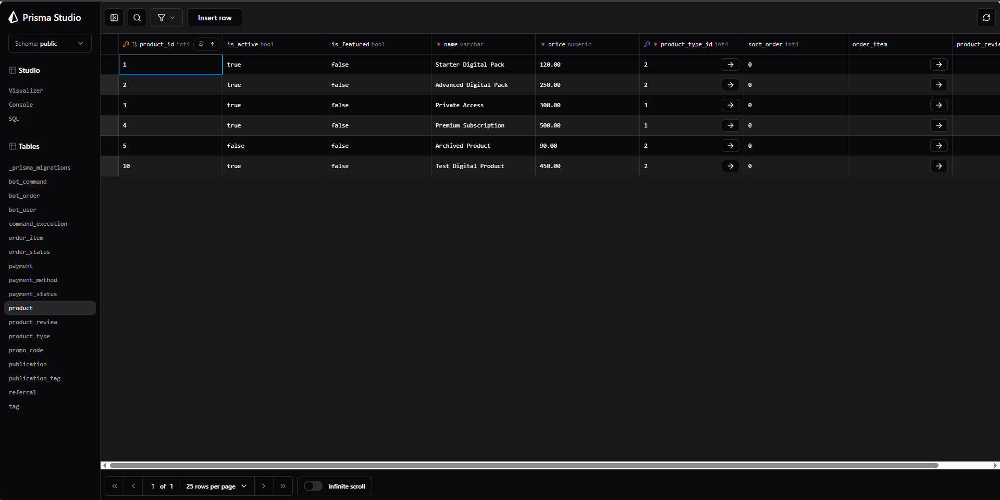

# Лабораторна робота №6. Міграції бази даних за допомогою Prisma ORM

**Тема:** використання Prisma ORM для роботи з існуючою базою даних PostgreSQL та створення міграцій.

**Мета роботи:** підключити Prisma ORM до вже створеної бази даних `bd_lab2_telegram_bot`, зчитати її структуру, створити початкову baseline-міграцію та виконати подальші зміни структури бази даних через Prisma Migrate.

**Виконав:** Гасюк Дмитро, група ІО-41

**Початкова база даних**

Для виконання лабораторної роботи використано базу даних `bd_lab2_telegram_bot`, яка була створена в попередніх лабораторних роботах. База даних містить таблиці користувачів, товарів, замовлень, платежів, публікацій, тегів, реферальної системи та команд Telegram-бота.

На початку роботи було створено Node.js-проєкт у папці `Lab6`, після чого встановлено Prisma ORM та Prisma Client.

Основні команди ініціалізації проєкту:

```powershell
npm init -y
npm install prisma --save-dev
npm install @prisma/client
npx prisma init --datasource-provider postgresql
```

Підключення до PostgreSQL було налаштовано через змінну `DATABASE_URL` у файлі `.env`. Файл `.env` не додається до репозиторію, оскільки він містить пароль до бази даних.

Для захисту службових і локальних файлів створено файл `.gitignore`:

```gitignore
node_modules/
.env
generated/
```

**Зчитування існуючої структури бази даних**

Після налаштування підключення Prisma була підключена до існуючої бази даних. Структура таблиць була автоматично зчитана за допомогою команди:

```powershell
npx prisma db pull
```

У результаті в файлі `prisma/schema.prisma` були створені моделі, що відповідають таблицям бази даних: `bot_user`, `product`, `bot_order`, `payment`, `publication`, `tag`, `promo_code`, `referral` та інші.

Після зчитування структури було виконано генерацію Prisma Client:

```powershell
npx prisma generate
```

**Baseline існуючої бази даних**

Оскільки база даних вже існувала до підключення Prisma, було створено початкову baseline-міграцію. Вона описує поточний стан бази даних і позначається як уже застосована.

Для цього було створено папку:

```text
prisma/migrations/0_init
```

Після цього сформовано файл початкової міграції:

```powershell
npx prisma migrate diff --from-empty --to-schema prisma/schema.prisma --script
```

Початкова міграція була позначена як застосована командою:

```powershell
npx prisma migrate resolve --applied 0_init
```

Після цього Prisma почала відстежувати подальші зміни структури бази даних через окремі міграції.

**Перша міграція: додавання таблиці відгуків**

Першою реальною зміною схеми стало додавання таблиці `product_review`. Вона призначена для збереження відгуків користувачів про товари.

До моделі `product` було додано зв’язок:

```prisma
product_review product_review[]
```

До моделі `bot_user` також було додано зв’язок:

```prisma
product_review product_review[]
```

Нова модель `product_review` має такий вигляд:

```prisma
model product_review {
  review_id  Int      @id @default(autoincrement())
  product_id Int
  user_id    Int
  rating     Int
  comment    String?
  created_at DateTime @default(now()) @db.Timestamp(6)

  product  product  @relation(fields: [product_id], references: [product_id], onDelete: Cascade)
  bot_user bot_user @relation(fields: [user_id], references: [user_id], onDelete: Cascade)

  @@unique([product_id, user_id])
}
```

Поле `review_id` є первинним ключем. Поля `product_id` і `user_id` є зовнішніми ключами. Обмеження `@@unique([product_id, user_id])` не дозволяє одному користувачу залишити більше одного відгуку на один товар.

Міграція була створена командою:

```powershell
npx prisma migrate dev --name add_product_review
```

У результаті було створено міграцію:

```text
20260526205012_add_product_review
```

**Друга міграція: додавання порядку сортування товарів**

Другою зміною було додано поле `sort_order` до таблиці `product`. Це поле можна використовувати для ручного сортування товарів у списку або каталозі.

До моделі `product` було додано поле:

```prisma
sort_order Int @default(0)
```

Фрагмент оновленої моделі `product`:

```prisma
model product {
  product_id      Int              @id @default(autoincrement())
  name            String           @db.VarChar(100)
  price           Decimal          @db.Decimal(10, 2)
  is_active       Boolean          @default(true)
  product_type_id Int
  is_featured     Boolean          @default(false)
  sort_order      Int              @default(0)

  order_item      order_item[]
  product_type    product_type     @relation(fields: [product_type_id], references: [product_type_id])
  product_review  product_review[]
}
```

Міграція була створена командою:

```powershell
npx prisma migrate dev --name add_product_sort_order
```

У результаті було створено міграцію:

```text
20260526205846_add_product_sort_order
```

**Третя міграція: додавання статусу модерації відгуку**

Третьою зміною було додано поле `moderation_status` до таблиці `product_review`. Це поле потрібне для контролю стану відгуку, наприклад `pending`, `approved` або `rejected`.

До моделі `product_review` було додано поле:

```prisma
moderation_status String @default("pending") @db.VarChar(20)
```

Оновлена модель `product_review`:

```prisma
model product_review {
  review_id         Int      @id @default(autoincrement())
  product_id        Int
  user_id           Int
  rating            Int
  comment           String?
  created_at        DateTime @default(now()) @db.Timestamp(6)
  moderation_status String   @default("pending") @db.VarChar(20)

  product  product  @relation(fields: [product_id], references: [product_id], onDelete: Cascade)
  bot_user bot_user @relation(fields: [user_id], references: [user_id], onDelete: Cascade)

  @@unique([product_id, user_id])
}
```

Міграція була створена командою:

```powershell
npx prisma migrate dev --name add_review_moderation_status
```

У результаті було створено міграцію:

```text
20260526210100_add_review_moderation_status
```

**Підсумкова структура міграцій**

Після виконання роботи структура папки `prisma/migrations` має такий вигляд:

```text
prisma/migrations/
├── 0_init/
├── 20260526205012_add_product_review/
├── 20260526205846_add_product_sort_order/
└── 20260526210100_add_review_moderation_status/
```

Міграція `0_init` використовується як початковий стан уже існуючої бази даних. Наступні три міграції містять реальні зміни структури бази даних.

**Перевірка результату**

Після виконання міграцій було запущено Prisma Studio:

```powershell
npx prisma studio
```

У Prisma Studio перевірено, що нова таблиця `product_review` була створена. У ній присутні поля `review_id`, `comment`, `created_at`, `moderation_status`, `product_id`, `rating` і `user_id`.


Також було перевірено таблицю `product`. У ній видно поля `is_featured` і `sort_order`, які були додані під час виконання міграцій.



**Висновок**

У лабораторній роботі було підключено Prisma ORM до існуючої бази даних PostgreSQL. За допомогою команди `prisma db pull` було зчитано структуру бази даних і сформовано файл `schema.prisma`.

Для вже існуючої схеми було створено baseline-міграцію `0_init`. Після цього виконано три окремі міграції: створення таблиці `product_review`, додавання поля `sort_order` до таблиці `product` та додавання поля `moderation_status` до таблиці `product_review`.

Результат міграцій перевірено через Prisma Studio. Структура бази даних була оновлена без видалення основних таблиць і без втрати даних.